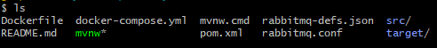
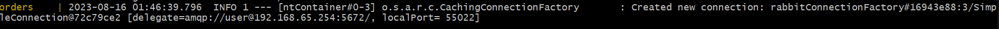
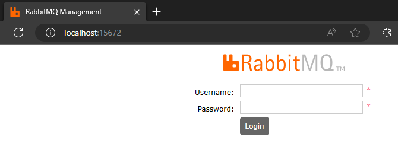
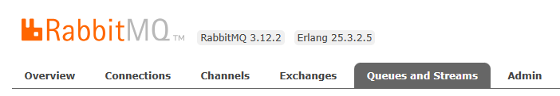
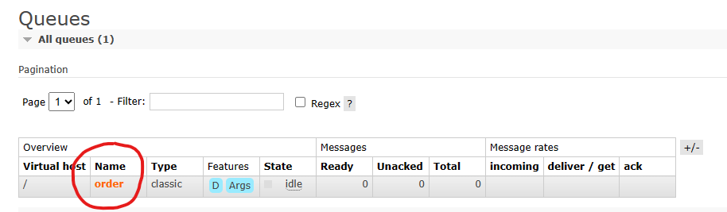
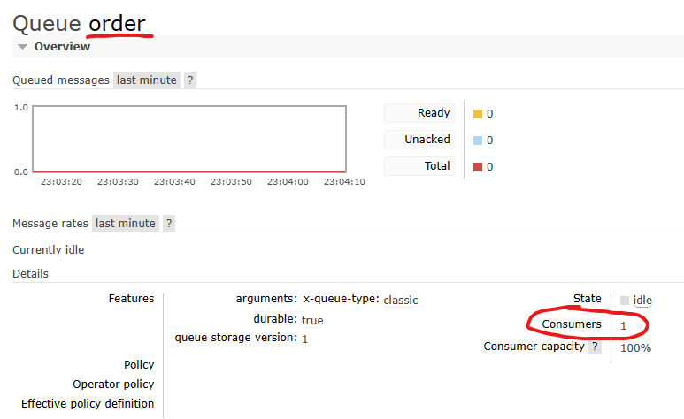
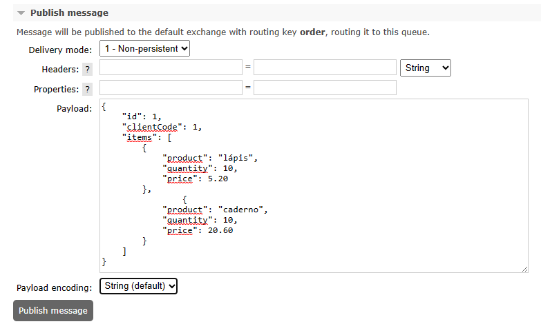
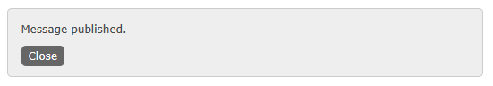
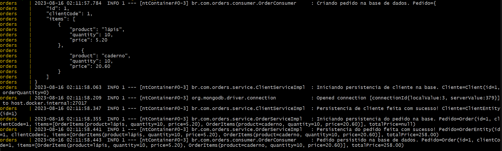
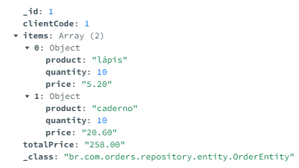

# Projeto de Processamento de Pedidos

### Para executar o projeto na máquina, é necessário ter os seguintes programas instalados:

```
1. Docker Desktop
2. Git
3. Postman
```

### Com os programas instalados, agora é só seguir o passo a passo:

1. Faça o clone deste repositório:

`git clone https://github.com/RaulLourenco/orders.git`

2. Abra a raiz do projeto pelo terminal (GitBash, CMD/Powershell, etc) e identifique o arquivo **`docker-compose.yml`**.



3. Execute o comando a seguir para iniciar os containers:

`docker-compose up`

4. Aguarde o comando terminar de subir os containers. Quando aparecer a mensagem de conexão com RabbitMQ quer dizer que já podemos testar a app.



5. Agora iremos acessar a Central de Gerenciamento do RabbitMQ. Abra o seu navegador e digite **http://localhost:15672/**, assim que estiver na tela de Login, digite o _Username_ **`user`** e o _Password_ **`password`** para logar na Central.



6. Estamos logados na Central! Para gerarmos uma mensagem, navegue até a aba **Queues and Streams**.



7. A fila que utilizaremos já estará criada para que possamos produzir uma mensagem. Clique no nome da fila **_order_**.



8. Esta é a tela da fila. Veja que ela está com 1 consumidor ativo, ou seja, nossa aplicação.



9. Para produzir uma mensagem, basta abrir a aba de _Publish message_ e colocar o Payload (JSON) de requisição e clicar no botão _Publish message_.

```JSON
{
    "id": 1,
    "clientCode": 1,
    "items": [
        {
            "product": "lápis",
            "quantity": 10,
            "price": 5.20
        },
                {
            "product": "caderno",
            "quantity": 20,
            "price": 17.30
        }
    ]
}
```



Fique à vontade para alterar os valores do JSON para cadastrar diversos pedidos.

10. Essa mensagem será exibida assim que o botão _Publish message_ for pressionado:



Isso quer dizer que nossa mensagem foi enviada à aplicação. Podemos conferir os logs da aplicação pelo terminal que rodou o comando `docker-compose up`.



11. Podemos consultar as informações do Pedido e do Cliente utilizando o Postman. A Collection que utilizei para testar está na pasta `collection`. Basta abrir o Postman, e importar a collection.

Temos 3 rotas nessa Collection, cada uma referente a uma consulta:

* http://localhost:8080/order/total_value/1 -> Onde **1** é o ID do Pedido.
* http://localhost:8080/order/total_quantity/1 -> Onde **1** é o ID do Cliente.
* http://localhost:8080/order/orders/1 -> Onde **1** é o ID do Cliente.

12. Caso queira visualizar os registros no banco (MongoDB), é possível instalar o **MongoDB Compass** para ver os dados direto na base.



Pronto! Agora a aplicação já está rodando e todos os passos necessários para interagir com ela estão detalhados aqui nesta documentação.

Crie vários Pedidos alterando os payloads e consulte os IDs gerados nas consultas disponibilizadas.
